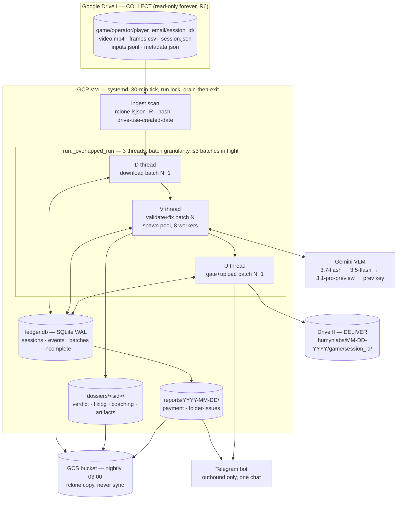
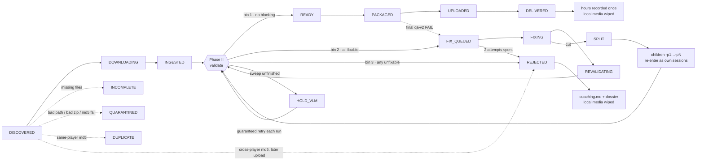

# Phase-1 Gaming Pipeline — architecture & flow

One-page internal reference for `pipeline/` (the production package) and the checks it wraps
(`tools/analyze_sample.py` engine + `translator qa-v2`).

**Job:** pull player uploads off Drive I → prove each session meets the Odyssey v1/v2 spec →
repair what is repairable → ship to Drive II → record the hours that get paid → report on
Telegram. Fully unattended, 30-min tick, resumable at any kill point.

---

## Architecture



## Session flow



---

## 1 · What it checks

**Phase I — arrival** (`ingest.py`). Path must be exactly `game/operator/player_email/session_id`
at depth 4, game ∈ {kamla, outer_wilds}, player folder a real email, session id matching
`…T…Z_<slug>_c_<16hex>` → else `QUARANTINED` + `INT_PATH`. All five `REQUIRED_FILES` present →
else tracked in `incomplete` (escalates at 48 h). Drive-side video md5 dedupe: same player →
`DUPLICATE`; cross-player → earliest `createdTime` wins (F3) → loser `INT_DUP_CROSS`. Download
verified against the Drive md5 (3 attempts); payload sniffed `v2|v1|raw|garbage`.

**Phase II — validation** (`validate.py`, one subprocess per session). Three evidence sources
merged into one reason list: **qa-v2** (`translator.v2.check_session_v2`), the **analysis engine**
(`tools/analyze_sample.py` — 4 s VLM sweep + lag/sync math), and the **scanner**
(`scanner.py` — full-video frame-diff, 1-frame-accurate).

| Family | Checks | Codes |
|---|---|---|
| Structure | 5 delivery files, no `key_binding.json`, v2 header, `rows == frame_count == video frames`, `frame_id` zero-based, `timestamp_ms` strictly increasing + endpoints, camera cols null, `0.0` float sentinels | `STR_HEADER_BAD` `STR_ROWS_MISMATCH` `STR_TS_NONMONO` `STR_TS_TAIL` `STR_CAMERA_NONNULL` `STR_SENTINELS` `STR_SJ_INVALID` `ARR_V1_FORMAT` `ARR_RAW_ONLY` `STR_VIDEO_UNREADABLE` |
| Sync | per-row timestamp vs **real PTS** ≤100 ms; controls↔video lag ≤50 ms target / 150 ms hard; dx/dy recomputed from raw sidecars | `SYN_TS_NOT_PTS` `SYN_LAG_CONST` `SYN_UNMEASURABLE_SUSPECT` |
| Inputs | keys→actions coupling, no same-literal fan-out, v2 token vocabulary, OS/system keys, L+R modifier bleed, keyboard / mouse-motion / mouse-button presence (motion missing = unrecoverable), actions inside a gated frozen window | `INP_KEYS_NO_ACTION` `INP_FANOUT` `INP_TOKEN_CASE` `INP_OSKEYS` `INP_BLEED` `INP_KEYS_MISSING` `INP_MOTION_MISSING` `INP_BUTTONS_MISSING` `INP_FROZEN_ACTIONS` |
| Content | ≥70 s (30 min soft cap), ≥3 distinct actions, irregular frame intervals (≤1 % pass · 1–5 % warn · >5 % reject), non-gameplay windows (menu/loading/pause/cutscene/scoreboard) at head/tail/mid, AFK >30 s over a near-static screen, notifications (edge vs mid-clip), burned-in chat/PII, black/frozen clip, game identity | `CNT_SHORT` `CNT_ACTIONS_FEW` `CNT_DROPS` `CNT_EDGE_NONGAMEPLAY` `CNT_MID_NONGAMEPLAY` `CNT_AFK` `CNT_NOTIF_EDGE` `CNT_NOTIF_MID` `CNT_CHAT_PII` `CNT_BLACK_FROZEN` `CNT_WRONG_GAME` `STR_GAME_MISMATCH` |
| Integrity | impossible mouse deltas, cross-player duplicate, bad drive path | `INT_TAMPER` `INT_DUP_CROSS` `INT_PATH` |

**Keep-vs-cut rule** (mid-clip non-gameplay), as amended by Adnaan's 2026-08-17 split-cascade
rulings R1–R3 — see the supersession ¶ in `PIPELINE_IMPLEMENTATION_PLAN.md` §5 for why:
span **≤5 s → keep** (and blank inputs inside it); **else split**. The test is ABSOLUTE — the old
`and ≤0.2 % of clip` term is deleted, because a fraction-of-clip allowance shrinks as the clip
shortens, so a blip a parent kept became a cut-trigger in its own child and splitting fed itself.
Both the frozen run and the full non-gameplay window must clear the bar, since the window is what
actually ships. Scanner-found static windows use the **same 5 s** and may only propose a cut ABOVE
it; at or below they are gating-only (they can raise `INP_FROZEN_ACTIONS` but create no child row),
which is what keeps the 40-candidate scan cap from driving a cascade. Edge non-gameplay
(`CNT_EDGE_NONGAMEPLAY`) is UNCHANGED and still trims at any length.

"Frozen" = window motion <40 % of this session's own live-gameplay
baseline — measured stillness, never VLM confidence. Every gating window gets a 1-frame-accurate
boundary from the scanner and a VLM label; a candidate nobody looked at is never silently passed (F5).

**Verdict:** bin 1 = no blocking reason → `READY`. bin 2 = every blocking reason `fixable` →
`FIX_QUEUED`. bin 3 = any blocking reason unfixable → `REJECTED`. VLM sweep unfinished → `HOLD_VLM`
(retried with a guaranteed batch every run) *unless* a video-independent unfixable reason already
decides it. Written to `dossiers/<sid>/verdict.json` with evidence + engine artifacts.

**Phase IV — final gate.** qa-v2 re-run on the *staged bytes* (not the work copy), plus remote
size+md5 verification after upload. Nothing is marked `DELIVERED` until the bytes on Drive II verify.

---

## 2 · How it corrects

Repairs happen **only on the local working copy** — Drive I is never written or deleted (R6).
Budget: **2 fix attempts per session** (`FIX_RETRIES`), then reject. Every step appended to
`dossiers/<sid>/fixlog.json`. After fixes the session goes back through the **full** Phase II —
the fresh verdict, never the stale plan, decides what remains.

Canonical order (later steps depend on earlier):

```
REMUX → V1_TO_V2 / TRANSLATE_RAW → REROUTE_GAME → RETRANSLATE (supersedes CSV fixes)
      → HEADER_REWRITE → ROWS_SURGERY → TSREPAIR_PTS      (structural, must precede any cut)
      → KEY_HYGIENE → ACTIONS_CONTEXT → other CSV writers
      → GATE_WINDOW                                       (LAST of the frames.csv writers)
      → RETRIM_HEAD / CUT_SEGMENTS
      → SESSIONJSON_RECOMPUTE
```

**Why `GATE_WINDOW` is last** (r-loop 3): it only BLANKS `input_keys` /
`input_actions`, so it is safe last — while every step above it re-derives
those same columns. `fix_key_hygiene` re-resolves actions for every row from
`keys | buttons` plus the motion flags, and motion-bound semantics (kamla
`look: mouse`) fire from `dx/dy` alone, which the gate deliberately leaves as
captured. Planned earlier, the gate came back with `input_actions` repopulated
on every frame that still had mouse motion — in the same pass that gated it —
so `INP_FROZEN_ACTIONS` re-fired on revalidation and burned the second fix
attempt. Do not "restore" the older order.

**Why the trim/cut comes AFTER the gate** (r-loop 4 for the head trim,
r-loop 5 for the cuts): gate windows carry PRE-trim timestamps — correct at
the moment the gate runs — and both `FIX_RETRIM_HEAD` and `FIX_CUT_SEGMENTS`
only slice rows and rebase the survivors; neither re-derives an input column,
so the blanking survives them and the cutter copies it into every child.
Dropping the gate instead (the pre-r-loop-4 behaviour, and the pre-r-loop-5
behaviour on the three cut exits) cost a whole fix attempt on the head path,
and on the cut path lost the parent's confirmed detection entirely: children
are inserted with `reasons_json="[]"`, so a segment could ship semantic
actions recorded during a confirmed freeze.

The cut path still short-circuits the OTHER pending fixes (hygiene, context,
…) — that asymmetry is deliberate. Their triggers are deterministic functions
of the CSV (`INP_OSKEYS` is re-derived identically from the child's own rows),
so nothing is lost by letting the child re-plan them with its own fresh
budget. A confirmed frozen WINDOW is not: it took a paid VLM sweep plus a
scanner measurement to establish, the child inherits no reasons, and a 3 s
freeze can fall between the VLM's 4 s samples and never be found again.

| Fix | Does |
|---|---|
| `FIX_RETRANSLATE` | **The universal strong fix.** Re-bins raw sidecar events onto the delivered video by real PTS, re-runs lag correction (≤3 iterations) and OW context gating, rewrites `frames.csv`. Requires `raw/`. |
| `FIX_TSREPAIR_PTS` / `FIX_LAGSHIFT_CSV` | No sidecars: rewrite `timestamp_ms` from real PTS; or shift input columns by `round(lag/frame)` rows and re-measure (fails loudly if drifting, not constant). |
| `FIX_CUT_SEGMENTS` | Lossless split around non-gameplay/AFK windows — keyframe-snapped video cut, CSV sliced to the real frame range, ids re-zeroed, timestamps rebased to each segment's own PTS. Segments <70 s dropped; parent → `SPLIT`; children `-pN` re-enter Phase II with their own budget. No survivor → reject. |
| `FIX_RETRIM_HEAD` | Head-only trim (notification/menu at clip start). Emitted **after** `GATE_WINDOW`: the gate's windows are pre-trim coordinates, correct at the moment it runs, and the retrim only slices head rows and rebases survivors — it never re-derives input columns. |
| `FIX_GATE_WINDOW` | Blanks `input_keys` **and** `input_actions` across a kept frozen window (spec §1.5.5 coupling). dx/dy and buttons stay — raw facts. Emitted before any trim/cut in the same plan, never dropped for one. Its span is the scanner-MEASURED frozen run (+`GATE_PAD_FRAMES`) whenever the scanner produced one — VLM window bounds are midpoints between sample times and are not stable across passes (RULED, Adnaan 2026-08-18). Records the inventory it destroys, so the content bars cannot later blame the player for rows the pipeline blanked. |
| `FIX_KEY_HYGIENE` | v2 token case, strip OS/system keys + control bytes, drop the spurious side of L+R bleed, re-resolve actions from surviving keys. |
| `FIX_ACTIONS_CONTEXT` | Outer Wilds only: context table gates multi-bound keys (no-op elsewhere). Always follows hygiene on OW. |
| `FIX_ROWS_SURGERY` · `FIX_HEADER_REWRITE` · `FIX_CAMERA_NULL` · `FIX_SENTINELS` | Mechanical CSV repairs. Row surgery only for \|Δ\| ≤ 2 tail rows — nothing is fabricated. |
| `FIX_REMUX` · `FIX_V1_TO_V2` · `FIX_TRANSLATE_RAW` · `FIX_REROUTE_GAME` | Unreadable container; obsolete v1 delivery; raw-only bundle; misfiled game (re-translates under the correct keybind). |
| `FIX_SESSIONJSON_RECOMPUTE` | Closes every chain — session.json recomputed from video + CSV ground truth. |

**Never corrected, always rejected:** missing mouse motion, missing keyboard with live video,
missing buttons with combat evidence, <70 s, <3 distinct actions, >5 % drops, mid-clip
notification, cross-player duplicate, tamper, out-of-scope game. These produce coaching, not repair.

Self-healing outside the fix path: quarantined-path heal (operator fixes the folder name),
drive-folder-move heal, supersede-after-reject (new md5 re-enters fresh, old verdict archived to
`dossier/history/`), ghost-incomplete prune, mid-split crash recovery via `.split-manifest.json`,
stale-lock reclaim, orphan-reject finalize, terminal-work sweep.

---

## 3 · Reports & payment

Everything is generated from the ledger. **Hours only, never money (R11).** The paid number is
`duration_delivered_s` — post-trim, post-cut, checksum-verified on Drive II.

**a) Per-batch topline** — fires when a batch closes with ≥1 delivered or rejected. Four lines:
batch/duration · `sessions: X/Y delivered (N auto-fixed) · M rejected (labels)` · `hours: +Δ →
Kamla a/500 · OW b/500 (Σ c/1000)` · `queue: P pending · I incomplete`. Adds a fallback-model line
when any verdict came from a laddered-down Gemini rung, and a pace-alarm line when needed
hours/day > 1.15 × trailing-24 h.

**b) Daily payment sheet** — first tick at/after **14:00 IST**, once per day (`.sent` marker).
Window is **contiguous**: from the stored anchor to `now − 4 h`, so every cohort in it has settled
before it is counted (empirical: p90 upload→outcome lag 2.77 h). Writes
`reports/<day>/payment-<day>.csv` + an `.md` twin, sends both message and file.

- **Cohort accounting**: a player's footage is judged in the window it was **uploaded** in
  (`drive_ctime`), regardless of when the outcome landed — otherwise pipeline latency reads as rejection.
- One row per `(operator, player_email)` spanning both games:
  `date · operator · player_email · kamla_hrs_uploaded · ow_hrs_uploaded · kamla_accepted_hrs ·
  ow_accepted_hrs · kamla_rejection_reasons · ow_rejection_reasons · total_uploaded_hours ·
  total_delivered_hours`. Totals sum the **rounded** parts so the visible columns add up.
- Accepted hours are walked **recursively** down the session tree, so split children's hours land on
  the parent upload's row; `SPLIT` nodes themselves contribute nothing.
- Uploaded ≠ accepted + rejected **by design** — head/tail trim and dropped segments are legitimate loss.
- **Reject reasons shown are unfixable-only**, judged per reason's own stored `fixable` field,
  deduped, ordered by frequency, **counts never printed**. A session rejected with only fixable
  reasons shows the bare `fix-failed` marker; unparseable reasons show `unreadable-reasons`.
- Double-count defence: counted roots are stamped `uploaded_reported_at` **before** the anchor and
  marker are written, so any kill errs toward a smaller resent sheet, never toward paid-twice hours.
  A late arrival whose window already closed joins the current sheet once its tree has settled.
  A non-zero pending cohort is logged loudly to stderr (its row's accepted hours are understated).

**c) Folder-issues report** — same trigger hour, own `.issues-sent` marker, sent only after the
payment message succeeded. A **live snapshot**, not windowed: incomplete uploads (with missing
files + age) and bad-path quarantines, oldest first. Separate message + CSV so chase-work can be
forwarded to operators without the payment sheet riding along. Empty snapshot → nothing sent.
Degrades to counts-only if the text would break Telegram's 4096-char cap.

**d) Alerts** — `⚠️`-prefixed, deduped per run: disk <100 GB (downloads pause), download/validation/
delivery crashes, upload failures, thread crashes, sessions still `HOLD_VLM` at end of run,
approaching the Drive 750 GB/day cap (alert at ~600 GB). systemd `OnFailure` units alert if a whole
run or the nightly GCS backup fails.

**e) On disk, not sent** — `payment-<day>.md` also carries a per-operator rollup, raw-code reject
detail with dossier paths, and the incomplete-folder list with >48 h coaching flags. `python -m
pipeline status` prints state counts, hours per game, incomplete count.

---

## 4 · How the TG bot works

**Outbound only.** `pipeline/telegram.py` is ~70 lines of `urllib` against
`api.telegram.org/bot<token>` with exactly two calls: `sendMessage` (60 s timeout) and
`sendDocument` (multipart, 120 s). There is **no `getUpdates`, no webhook, no command handling, no
inbound path** — nothing can be asked of it and it never reads a reply.

- **Identity**: `TELEGRAM_BOT_TOKEN` + `TELEGRAM_CHAT_ID` from `~/.config/hl-gamedata/secrets.env`
  (outside the repo, never logged). One fixed chat. `test_mode` prefixes every message with `TEST`.
- **Who sends**: the U thread (batch toplines), the run's periodic duties and end-of-run hook (daily
  payment + folder issues), and `_alert()` from any thread (D/V/U) under a lock that makes the
  per-run dedup check-then-append atomic.
- **Failure is never fatal.** Every send is wrapped; `TelegramError` is printed to stderr and the run
  continues. The token is redacted *before* truncation in any error string.
- **Retry doctrine**: the day-marker is written only after a successful *message* send, so a failed
  send retries on the next 30-min tick — a duplicate message is the accepted failure mode, a missing
  report is not. If the message lands but the *attachment* fails, a follow-up message reports the
  file's path on the VM.

---

## Numbers in one place (`pipeline/config.py` — human-edit only, git-logged)

`MIN_CLIP_S 70` · soft max 30 min · `MIN_DISTINCT_ACTIONS 3` ·
keep-gate `KEEP_GATE_MAX_S 5.0` (absolute; `KEEP_GATE_MAX_FRAC` **deleted** — R2/R3, Adnaan
2026-08-17) · scanner statics `SCANNER_STATIC_MIN_S 0.8`, cut only above the same 5 s (R1) ·
`AFK_MIN_S 30` · frozen `<40 %` of baseline · drops `≤1 % pass / 1–5 % warn / >5 % reject` ·
lag `50 ms target / 150 ms hard` · frame-sync `≤100 ms` · `BATCH_SIZE 10` · `≤3 batches in flight` ·
8 validation workers · `FIX_RETRIES 2` · rrd sample `20 %` (15 % floor) · disk low-water `100 GB` ·
report hour `14:00 IST` · report offset `4 h` · targets `500 h/game delivered`, `600 h/game
collected` · deadline `2026-08-24 23:59 IST` · pace alarm `×1.15` · lagging-game priority `>10 %` ·
ledger backups kept `14`.

**Live switches:** `VLM_GAME_TRIPWIRE_GATES = False` (VLM game-ID is report-only in Phase 1) ·
`VLM_FAILOVER_ENABLED = False` (Vertex returns 403 for both keys) · `PIPELINE_OVERLAP = True`
(False = byte-identical lockstep fallback).

**Paths:** work `~/hl-pipeline/{work,dossiers,reports,logs,delivery-stage,backups}` ·
`ledger.db` (SQLite WAL, `events` table is the immutable audit trail) · `run.lock` (pid-checked,
rename-aside reclaim) · secrets `~/.config/hl-gamedata/secrets.env` · remotes `drive-collect:`
(read-only) and `drive-deliver:` · nightly `rclone copy` to GCS at 03:00.
